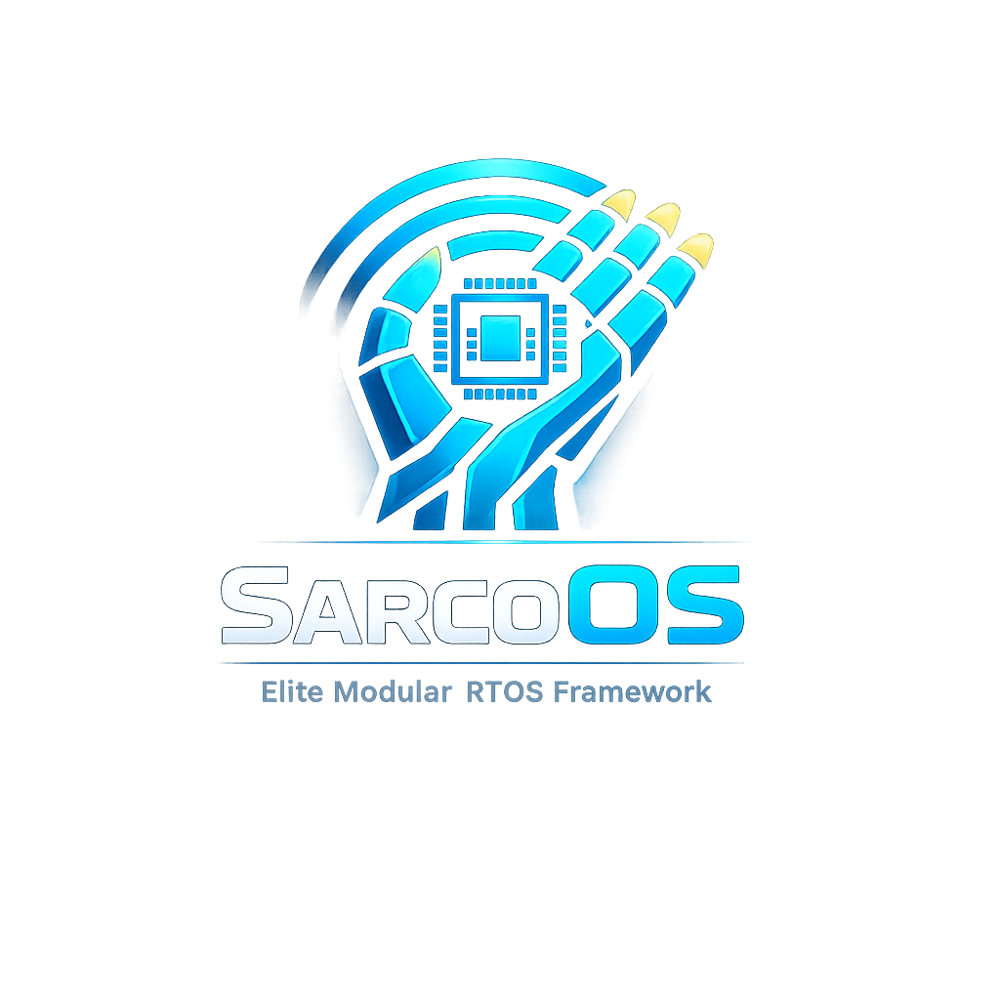

<div align="center">
  
  <h1>SarcoOS — Presentation Website</h1>
  <p><strong>Elite Modular RTOS Framework for Teleoperation & Robotics</strong></p>

  [](https://ziadmohamed0.github.io/Sarcos_web_site)
  [](https://opensource.org/licenses/MIT)
  [](#)
  [](#)
</div>

---

## Overview

A modern, animated, single-page presentation website for the **SarcoOS** graduation project. Designed to be presented to faculty doctors and academic panels at **Helwan International Technology University**.

Built with **pure HTML, CSS, and JavaScript** — no frameworks, no build tools. Ready to deploy instantly on **GitHub Pages**.

## Sections

| Section | Description |
|---------|-------------|
| **Hero** | Full-screen particle canvas with typing effect, animated counters, and parallax fade |
| **Overview** | 6 feature cards introducing project capabilities |
| **Tech Stack** | Categorized technology badges (Firmware, Communication, Robotics, HMI, CAD, PCB) |
| **Architecture** | Interactive system flow diagram with data orchestration pipeline |
| **Firmware** | Layered HAL/MCAL visualization with Node A / Node B detail cards |
| **ROS 2** | 4 ROS packages with data flow diagram |
| **CAD & PCB** | SolidWorks, KiCad, and Teleoperation Suit design cards |
| **Gallery** | 12 images across 3 categories (Hardware, CAD Renders, Robot Photos) with lightbox |
| **Dashboard** | IIoT Node-RED dashboard feature cards |
| **Timeline** | 6-phase project development journey |
| **Team** | Team cards with supervisor and technical lead |
| **Stats Banner** | Animated counters across the full width |

## Features

- **Particle canvas** with mouse/touch interaction (cyan + gold)
- **Typing effect** on hero subtitle
- **Animated counters** with easing (Intersection Observer triggered)
- **Scroll progress bar** at the top of the page
- **Preloader** with progress simulation
- **Image gallery** with lightbox viewer (click to expand)
- **Back-to-top** floating button
- **Timeline** staggered fade-in animation
- **Scroll-triggered reveal** animations on all sections
- **Responsive design** — mobile, tablet, desktop
- **Smooth scrolling** between sections
- **Dark theme** with electric blue + gold accents

## Deployment (GitHub Pages)

```bash
# Clone the repo
git clone https://github.com/ziadmohamed0/Sarcos_web_site.git
cd Sarcos_web_site

# Or if already cloned, just push
git add -A
git commit -m "Update website"
git push origin main
```

Then in your GitHub repo:
1. Go to **Settings → Pages**
2. Under "Source", select **Deploy from a branch**
3. Select **main** branch and **/(root)** folder
4. Click **Save**

Your site will be live at `https://ziadmohamed0.github.io/Sarcos_web_site`

## Local Development

```bash
# Serve locally with Python
python3 -m http.server 8080
# Open http://localhost:8080
```

## File Structure

```
Sarcos_web_site/
├── index.html          # Main HTML (all sections)
├── css/
│   └── style.css       # All styles (1,200+ lines)
├── js/
│   └── main.js         # All JS (400+ lines)
├── assets/
│   ├── new_logo.png       # SarcoOS logo
│   ├── esp32.jpg          # ESP32 board photo
│   ├── bts.jpg            # BTS7960 driver photo
│   ├── tb6600.jpeg        # TB6600 driver photo
│   ├── mpu6050.png        # MPU6050 IMU sensor
│   ├── servos.png         # Feetech servos
│   ├── ultrasonicc.jpeg   # HC-SR04 ultrasonic sensor
│   ├── nodered.png        # Node-RED dashboard
│   ├── fifteen52_rim.png  # CAD rim render
│   ├── tire_assembly.png  # CAD tire assembly
│   ├── servo_cad.jpg      # Servo CAD exploded view
│   ├── robot_photo_1.jpeg # Robot assembly photo
│   ├── robot_photo_2.jpeg # Robot side view
│   └── robot_photo_3.jpeg # Robot top view
└── README.md           # This file
```

## Tech Stack (Website)

| Technology | Purpose |
|------------|---------|
| HTML5 | Structure & semantics |
| CSS3 | Styling, animations, responsive layout |
| Vanilla JS | Interactivity, canvas, animations |
| Font Awesome 6 | Icons |
| Google Fonts | Inter + JetBrains Mono typography |

## License

MIT &copy; 2026 Ziad Mohammed Fathy
